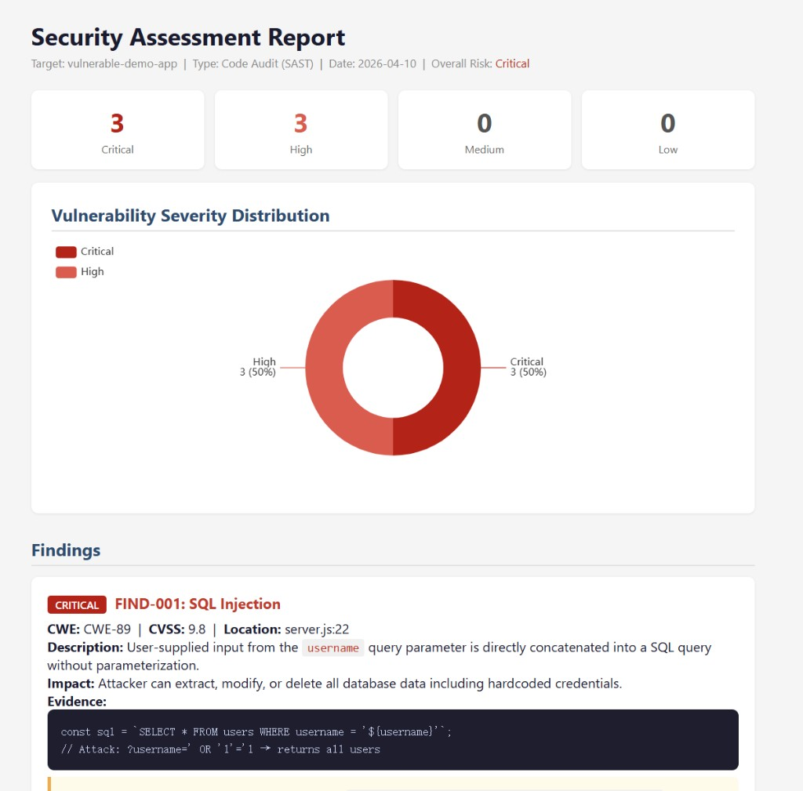

# AuditSentry — Portable Security Skills for AI Agents

<!-- lang:zh -->
AuditSentry 是**可独立安装、多宿主可用**的安全分析技能集（Markdown + YAML frontmatter），适用于 **Claude Code、Cursor、OpenAI Codex、Trae** 等能加载项目规则、技能或长上下文的 AI 编程助手。内容涵盖代码审计、渗透测试、CTF、安全报告与 CVE 查询；内置通用工作流技能（调试、验证、评审、规划），**不依赖** Superpowers 插件即可闭环使用。
<!-- /lang:zh -->

<!-- lang:en -->
AuditSentry is a **standalone, host-portable** security skill set (Markdown + YAML frontmatter) for **Claude Code, Cursor, OpenAI Codex, Trae**, and other agents that support rules, skills, or long-context project docs. It covers auditing, pentesting, CTF work, reporting, and CVE research, with a built-in workflow skill — **no** Superpowers plugin required.
<!-- /lang:en -->

---

<!-- lang:zh -->
## 快速上手 / Quick Start
<!-- /lang:zh -->

<!-- lang:en -->
## Quick Start
<!-- /lang:en -->

<!-- lang:zh -->
在 AI 助手对话框中直接输入，让 AuditSentry 自动审计你的项目：
<!-- /lang:zh -->

<!-- lang:en -->
Type directly in your AI assistant to let AuditSentry audit your project:
<!-- /lang:en -->

```
# 审计指定项目有没有漏洞 / Audit a project for vulnerabilities
"用 AuditSentry 技能审计 my-project 项目，看有没有漏洞"
"Use AuditSentry to audit the my-project codebase for vulnerabilities"

# 审计前端项目 / Audit a frontend project
"用 AuditSentry 审计 anysign-saas-h5-frontend 项目的安全漏洞"

# 审计并生成报告 / Audit and generate report
"用 AuditSentry 审计 user-service 项目，完成后生成 HTML 安全报告"

# CVE 查询 / CVE lookup
"用 AuditSentry 查询 CVE-2024-1234 的风险评级"
```

> **Cursor / Codex 用户：** 在任务开始时 **`@`** 对应的 `SKILL.md` 文件，或在项目规则中写入 `AGENTS.md` 的内容，即可确保技能被正确激活。

---

<!-- lang:zh -->
## 报告示例 / Report Example
<!-- /lang:zh -->

<!-- lang:en -->
## Report Example
<!-- /lang:en -->

<!-- lang:zh -->
AuditSentry 审计完成后自动生成**离线 HTML 安全报告**，包含 ECharts 环形图（各项目漏洞占比 / 严重级别分布）、多项目 Tab 切换、漏洞详情与修复建议。
<!-- /lang:zh -->

<!-- lang:en -->
After an audit, AuditSentry automatically generates a **self-contained HTML security report** with ECharts donut charts (project proportion / severity distribution), multi-project tabs, and detailed findings with remediation guidance.
<!-- /lang:en -->



> 完整可交互示例：[`examples/report-example.html`](examples/report-example.html)（浏览器直接打开，无需服务器）

---

<!-- lang:zh -->
## 多宿主兼容 / Multi-host compatibility
<!-- /lang:zh -->

<!-- lang:en -->
## Multi-host compatibility
<!-- /lang:en -->

<!-- lang:zh -->
- **格式**：每个技能是 `SKILL.md` 文件，含 YAML `name` / `description` 与正文说明；任意客户端只要能把该文件纳入系统提示、规则或知识库即可使用。
- **引用名**：文档中的 `sentinel:skill-name` 表示**逻辑技能 id**（与文件夹名对应）。各产品中的挂载方式不同：可能是插件技能 id、Cursor Rule、Codex skill、或你在对话里 `@` / 粘贴的文件路径——以对应产品文档为准。
- **触发**：支持「按 description 自动匹配技能」的宿主可能自动选用；其它环境请在任务开始时**显式**打开或粘贴相关 `SKILL.md`，或在项目规则中写明「安全类任务先遵循 `skills/sentinel/SKILL.md`」。
<!-- /lang:zh -->

<!-- lang:en -->
- **Format:** Each skill is a `SKILL.md` with YAML `name` / `description` plus body text. Any client that can load that file into system instructions, rules, or a knowledge bundle can use it.
- **IDs:** `sentinel:skill-name` is a **logical skill id** (matches the folder name). Mapping differs by product — follow that product's docs.
- **Activation:** Hosts with skill discovery may auto-match from `description`. Else **explicitly** open or paste the `SKILL.md`, or point project rules at `skills/sentinel/SKILL.md` for security tasks.
<!-- /lang:en -->

| 宿主 / Host | 常见接入方式 / Typical wiring |
|-------------|-------------------------------|
| **Claude Code** | 插件 / 全局或项目 `skills` 目录 |
| **Cursor** | 项目 `.cursor/rules/`、`AGENTS.md`、或 Cursor Skills |
| **Codex CLI** | `~/.codex/skills`、项目 `.codex` 约定路径 |
| **Trae** | 导入 `skills/sentinel/` 作为可读文档 |
| **其它 / Others** | 将所需 `SKILL.md` 复制到该工具要求的目录 |

---

<!-- lang:zh -->
## 技能列表 / Skills
<!-- /lang:zh -->

<!-- lang:en -->
## Skills
<!-- /lang:en -->

| Skill | 用途 / Purpose |
|-------|----------------|
| `sentinel` | **短路径总入口** — `skills/sentinel/SKILL.md`，子命令路由到各子技能 |
| `sentinel:using-sentinel` | 入口技能，路由到正确的技能 / Entry point — routes to the right skill |
| `sentinel:sentinel-audit` | 源代码安全审计 (OWASP, SAST) / Source code security audit |
| `sentinel:sentinel-pentest` | 渗透测试工作流 / Penetration testing workflow |
| `sentinel:sentinel-frontend` | 前端安全 (Vue/React/Angular) / Frontend security |
| `sentinel:sentinel-report` | 安全报告撰写 + 离线 HTML / Security report + offline HTML |
| `sentinel:sentinel-cve` | CVE 查询、CVSS 评分 / CVE lookup, CVSS scoring |
| `sentinel:sentinel-ctf` | CTF 挑战解题 / CTF challenge solving |
| `sentinel:sentinel-workflow` | 根因分析、完成前验证、安全评审 / Root cause, verification, review |

---

<!-- lang:zh -->
## 安全报告导出（HTML） / Security report export
<!-- /lang:zh -->

<!-- lang:en -->
## Security report export
<!-- /lang:en -->

<!-- lang:zh -->
`sentinel:sentinel-report` 收尾时**默认**生成合并 **Markdown + 单个 `.html`**；**须询问保存到哪个文件夹**（未指定则默认工作区根）；用户可明确说不要 HTML。

**HTML 图表双模式：**
- **在线**：ECharts CDN 环形图（各项目漏洞占比 + 各项目内部严重级别分布）
- **离线/内网**：纯 CSS 横向条形图 + 堆叠条（无外部依赖）

生成时 AuditSentry 会自动询问：「能访问外网（ECharts 动态图）还是离线（静态条形图）？」
<!-- /lang:zh -->

<!-- lang:en -->
`sentinel:sentinel-report` defaults to **merged Markdown + one `.html`**. It **must ask** which folder to save into; users may opt out of HTML.

**Chart dual-mode:**
- **Online:** ECharts CDN donut charts (project proportion + per-project severity)
- **Offline/intranet:** Pure CSS horizontal bars + stacked bars (no external deps)
<!-- /lang:en -->

<!-- lang:zh -->
### 审计 / 渗透结束必衔接 sentinel-report

- 使用 **`sentinel-audit`**、**`sentinel-pentest`** 或 **`sentinel-frontend`** 完成分析后，**不得**仅以聊天中的条目列表收尾。
- **必须**继续按 **`sentinel:sentinel-report`** 执行：走 **Closing gate**（询问保存文件夹、在线/离线），用写入工具生成 **`sentinel-security-assessment.md`** 与 **`.html`**（除非用户明确只要粘贴、不要文件）。
<!-- /lang:zh -->

<!-- lang:en -->
### Always chain `sentinel-report` after audit / pentest

- After **final findings** from **`sentinel-audit`**, **`sentinel-pentest`**, or **`sentinel-frontend`**, do **not** stop at a chat-only list.
- **Must** follow **`sentinel:sentinel-report`**: run the **Closing gate** and **`Write`** `sentinel-security-assessment.md` + `.html` to disk.
<!-- /lang:en -->

---

<!-- lang:zh -->
## 漏洞覆盖 / Vulnerability Coverage
<!-- /lang:zh -->

<!-- lang:en -->
## Vulnerability Coverage
<!-- /lang:en -->

| 类别 / Category | 示例 / Examples |
|-----------------|-----------------|
| **A01 — 访问控制 / Access Control** | IDOR、水平越权、垂直越权、权限绕过 |
| **A02 — 密码学失败 / Cryptographic Failures** | 弱加密、硬编码密钥、TLS 问题 |
| **A03 — 注入 / Injection** | SQL、命令、LDAP、XPath、NoSQL、模板注入 |
| **A04 — 不安全设计 / Insecure Design** | 业务逻辑缺陷、竞争条件 (TOCTOU) |
| **A05 — 安全配置错误 / Security Misconfiguration** | Debug 模式、默认凭证、信息泄露 |
| **A06 — 危险组件 / Vulnerable Components** | 依赖漏洞、过期库、typosquatting |
| **A07 — 认证失败 / Auth Failures** | 暴力破解、会话 fixation、JWT 漏洞 |
| **A08 — 数据完整性 / Data Integrity** | 不安全反序列化、CI/CD 注入 |
| **A09 — 日志监控失败 / Logging Failures** | 缺少安全日志、PII 泄露 |
| **A10 — SSRF** | 服务端请求伪造、内网探测 |
| **A11 — CSRF** | 跨站请求伪造、Token 验证 |
| **A12 — 点击劫持 / Clickjacking** | Frame busting、X-Frame-Options |
| **A13 — 会话安全 / Session Security** | Session fixation、Timeout、Cookie flags |
| **A14 — 资源消耗 / Resource Consumption** | 无限制上传、无 Rate limiting |
| **A15 — OAuth/SSO** | redirect_uri 绕过、state 参数 CSRF |
| **A16 — WebSocket** | WS 认证缺失、授权检查 |
| **A17 — CORS 错误配置** | Wildcard + Credentials |
| **A18 — GraphQL** | Introspection 滥用、批量查询 DoS |
| **A19 — 竞争条件 / Race Conditions** | 双重提现、优惠券复用 |
| **A20 — 子域名接管 / Subdomain Takeover** | 悬空 DNS、过期云服务 |
| **前端 XSS** | Vue v-html、React dangerouslySetInnerHTML |
| **供应链 / Supply Chain** | 恶意包、依赖混淆 |

---

<!-- lang:zh -->
## 安装 / Installation
<!-- /lang:zh -->

<!-- lang:en -->
## Installation
<!-- /lang:en -->

```bash
# 克隆仓库，入口为 skills/sentinel/SKILL.md
git clone https://github.com/wangdongzuopin/sentinel-skill
```

| 宿主 / Host | 示例 / Example |
|-------------|----------------|
| **Claude Code** | 将 `skills/sentinel/` 拷入或链接到项目的 `.claude/skills/sentinel/` |
| **Cursor** | 使用根目录 `AGENTS.md`；或将技能纳入 `.cursor/rules` |
| **Codex** | 将 `skills/sentinel/*` 同步到 `~/.codex/skills` |
| **Trae / 其它** | 导入本仓库，使助手能读取 `skills/sentinel/**/*.md` |

---

<!-- lang:zh -->
## 目录结构 / Directory Structure
<!-- /lang:zh -->

<!-- lang:en -->
## Directory Structure
<!-- /lang:en -->

```
auditsentry/
├── README.md
├── AGENTS.md                  # 多宿主项目级入口提示
├── assets/
│   └── report-preview.png     # 报告效果截图
├── examples/
│   └── report-example.html    # 可交互 HTML 报告示例
└── skills/
    └── sentinel/              # AuditSentry 技能包
        ├── SKILL.md                   # 短路径总入口 (name: sentinel)
        ├── using-sentinel/
        │   └── SKILL.md               # 入口技能 / Entry point
        ├── sentinel-workflow/
        │   └── SKILL.md               # 内置工作流
        ├── sentinel-audit/
        │   ├── SKILL.md               # 审计方法论
        │   └── references/
        │       ├── patterns-php.md
        │       ├── patterns-python.md
        │       ├── patterns-js.md
        │       ├── patterns-java.md
        │       └── patterns-idor.md
        ├── sentinel-pentest/
        │   └── SKILL.md               # 渗透测试
        ├── sentinel-ctf/
        │   └── SKILL.md               # CTF 挑战
        ├── sentinel-report/
        │   └── SKILL.md               # 报告模板 + HTML 生成
        ├── sentinel-cve/
        │   └── SKILL.md               # CVE 查询
        └── sentinel-frontend/
            ├── SKILL.md               # 前端安全
            └── references/
                ├── patterns-vue.md
                ├── patterns-react.md
                └── patterns-angular.md
```

---

<!-- lang:zh -->
## 使用流程 / Usage Workflow
<!-- /lang:zh -->

<!-- lang:en -->
## Usage Workflow
<!-- /lang:en -->

### Step 1: 检测架构 / Detect Architecture

```
☐ 确定应用类型
  ├── 前端 Frontend      → Vue.js / React / Angular
  ├── 后端 Backend       → PHP / Python / Node.js / Java / Go
  ├── API               → REST / GraphQL / gRPC
  └── 基础设施 Infra     → Docker / Kubernetes / Cloud
```

### Step 2: 路由到对应技能 / Route to Skill

| 架构 / Architecture | 技能 / Skill |
|---------------------|--------------|
| Vue / React / Angular | `sentinel:sentinel-frontend` |
| PHP / Python / Node.js / Java | `sentinel:sentinel-audit` |
| REST / GraphQL API | `sentinel:sentinel-audit` |
| 授权渗透测试 / Authorized Pentest | `sentinel:sentinel-pentest` |
| CTF 挑战 | `sentinel:sentinel-ctf` |
| CVE 查询 | `sentinel:sentinel-cve` |
| 生成报告 | `sentinel:sentinel-report` |

### Step 3: 生成报告 / Generate Report

```
审计 / 渗透完成
    ↓
自动衔接 sentinel-report
    ↓
询问：保存目录？在线/离线图表？多项目 Tab？
    ↓
写入 sentinel-security-assessment.md
写入 sentinel-security-assessment.html（含 ECharts 饼图）
```

### 典型完整流程

```
1. "用 AuditSentry 审计 my-api 项目"
       ↓ sentinel:sentinel-audit 执行审计
2. 审计完成，自动触发 sentinel:sentinel-report
       ↓ 询问报告保存路径
3. 生成 sentinel-security-assessment.md + .html
       ↓ HTML 含环形图：各项目漏洞占比 + 严重级别分布
4. 用浏览器打开 .html 即可查看可交互报告
```

---

<!-- lang:zh -->
## 内置工作流 / Built-in Workflow
<!-- /lang:zh -->

<!-- lang:en -->
## Built-in Workflow
<!-- /lang:en -->

`sentinel:sentinel-workflow` 提供系统化根因追踪、完成前验证、面向安全的代码评审、威胁向设计探索和多目标并行分析，**不依赖** Superpowers 等外部插件。

| 意图 / Intent | AuditSentry 内置 |
|---------------|-----------------|
| 调试根因 / Debug | `sentinel-workflow` → Systematic root-cause tracing |
| 完成前验证 / Verify | `sentinel-workflow` → Verification before completion |
| 代码评审 / Code review | `sentinel-workflow` → Security-focused review |
| 方案探索 / Design | `sentinel-workflow` → Design exploration |
| 多目标并行 / Parallel | `sentinel-workflow` → Parallel multi-target work |

---

<!-- lang:zh -->
## 伦理与法律 / Ethics & Legal
<!-- /lang:zh -->

<!-- lang:en -->
## Ethics & Legal
<!-- /lang:en -->

AuditSentry 技能包含强制授权检查。所有渗透测试指导假设：

- 系统所有者提供的**书面授权** / Written authorization from system owner
- 明确界定的**测试范围** / Clearly defined scope
- **负责任的披露**实践 / Responsible disclosure practices

AuditSentry 不会协助未授权的系统访问。

---

<!-- lang:zh -->
## 贡献 / Contributing
<!-- /lang:zh -->

<!-- lang:en -->
## Contributing
<!-- /lang:en -->

技能文件格式遵循各 AI 助手常见的「带 YAML 头的 Markdown 技能」约定（与 Claude Code、Codex、Cursor 等生态兼容）。
