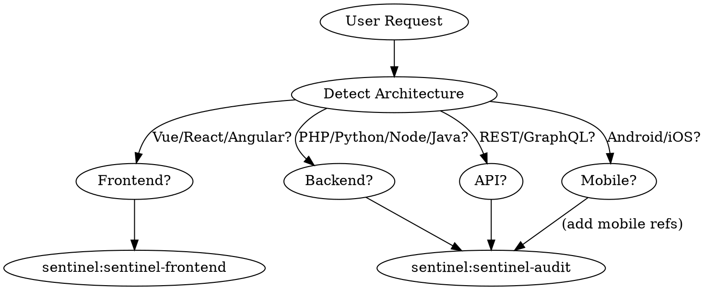

# Using Sentinel

**Multi-host:** This file is plain Markdown with YAML frontmatter. Use it from **Claude Code, Cursor, Codex, Trae**, or any agent that can load project rules or skill files. The prefix `sentinel:` in examples is a **logical id** — your client may expose it as a rule name, plugin skill, or file path.

Sentinel is a **standalone** security skill suite. It follows the same discipline as leading agent workflow packs: **if a security skill might apply, invoke it. No exceptions.**

## Instruction Priority

1. **User's explicit instructions** — highest priority
2. **Sentinel security skills** — override defaults for security tasks (`sentinel-audit`, `sentinel-frontend`, `sentinel-pentest`, `sentinel-ctf`, `sentinel-cve`, `sentinel-report`)
3. **`sentinel-workflow`** — systematic debugging, verification, structured review, and planning (see below)
4. **Default system behavior** — lowest priority

## Skill Selection

**Step 1: Detect Architecture/Technology Stack FIRST**

Before invoking any skill, identify what you're working with:

```
☐ What is the application type?
  ├── Web (Frontend)     → Vue.js / React / Angular
  ├── Web (Backend)      → PHP / Python / Node.js / Java / Go / C#
  ├── Mobile             → Android (Kotlin/Java) / iOS (Swift/ObjC)
  ├── API-only           → REST / GraphQL / gRPC
  ├── Desktop            → Electron / Qt / .NET
  └── Infrastructure     → Docker / Kubernetes / Cloud configs

☐ What is the framework (if any)?
  ├── PHP: Laravel / Symfony / CodeIgniter / WordPress
  ├── Python: Django / Flask / FastAPI
  ├── Java: Spring / Struts / Jakarta EE
  ├── Node.js: Express / Koa / NestJS / Next.js
  └── Go: Gin / Echo / Fiber

☐ What is the deployment environment?
  ├── On-premise / Cloud (AWS/GCP/Azure)
  ├── Containerized (Docker/Kubernetes)
  └── Serverless
```

**Step 2: Route Based on Architecture**

| Architecture Detected | Primary Skill | Reference Files |
|-----------------------|---------------|-----------------|
| **Frontend (Vue/React/Angular)** | `sentinel:sentinel-frontend` | `patterns-vue.md`, `patterns-react.md`, `patterns-angular.md` |
| **Backend (PHP)** | `sentinel:sentinel-audit` | `patterns-php.md` |
| **Backend (Python)** | `sentinel:sentinel-audit` | `patterns-python.md` |
| **Backend (Node.js)** | `sentinel:sentinel-audit` | `patterns-js.md` |
| **Backend (Java)** | `sentinel:sentinel-audit` | `patterns-java.md` |
| **API (REST/GraphQL)** | `sentinel:sentinel-audit` | + IDOR patterns |
| **Full Stack** | `sentinel:sentinel-audit` | + frontend + backend refs |
| **Live System (authorized)** | `sentinel:sentinel-pentest` | — |
| **CTF Challenge** | `sentinel:sentinel-ctf` | — |
| **Report Writing** | `sentinel:sentinel-report` | — |
| **Root cause, verification, structured review, parallel targets** | `sentinel:sentinel-workflow` | — |

**Skill Routing Flow:**



**When in doubt:** Invoke `sentinel:sentinel-audit` first — it covers the broadest ground and includes cross-site/framework patterns.

## Core Security Mindset

Before invoking any sentinel skill, adopt this posture:

- **Think like an attacker.** What would a malicious actor target first?
- **Trust nothing.** Every input, every boundary, every assumption is suspect.
- **Evidence over intuition.** Document what you find, not what you feel.
- **Scope matters.** Never exceed authorized scope. Confirm before acting.

## Built-in workflow (no external plugin required)

- Use `sentinel:sentinel-workflow` for root-cause tracing, pre-completion verification, security-focused review of diffs, design exploration, and parallel multi-target analysis
- Use `sentinel:sentinel-report` at the end of any engagement that needs a structured write-up

Optional: if your environment also loads the Superpowers plugin, you may use those workflow skills interchangeably with `sentinel-workflow` for the same class of tasks.

## Red Flags

Stop and re-read the appropriate skill if you catch yourself:
- Guessing at vulnerabilities without evidence
- Skipping scope confirmation before active testing
- Reporting a finding without a verified reproduction path
- Mixing exploit development with authorized scope
